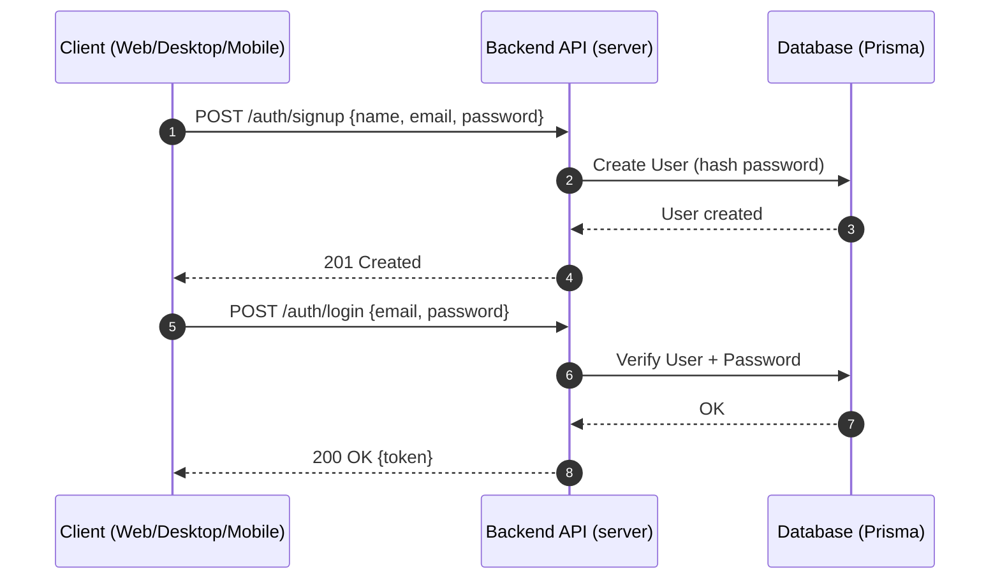
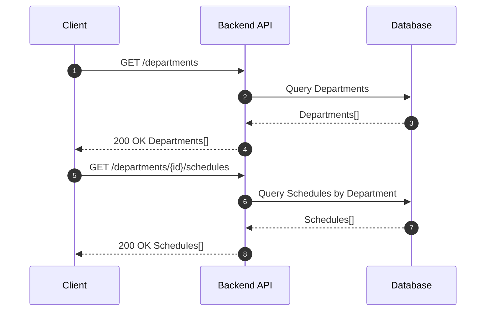
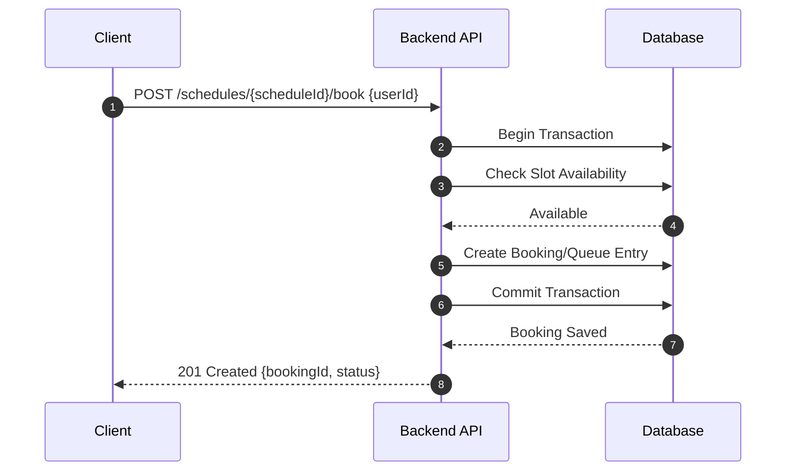
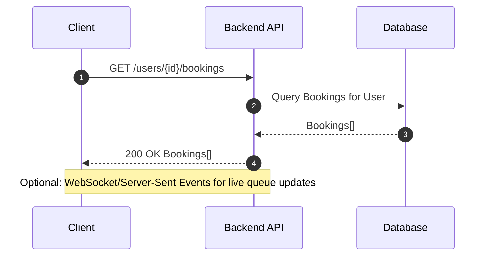

# QueueKiller Data Flow

This document explains how data moves between the frontend clients (Web, Desktop, Mobile), the backend API, and the database in QueueKiller. It references the three visual diagrams located in the docs folder and complements them with sequence diagrams and concise explanations.

- Frontend overview image: `docs/frontendFlow.png`
- Backend overview image: `docs/backendFlow.png`
- Database overview image: `docs/databaseFlow.png`

## High-Level Overview

All client applications (web in `client/`, desktop in `apps/desktop/`, mobile in `apps/mobile/`) communicate with the backend HTTP API hosted by `server/`. The backend uses Prisma (see [server/prisma/schema.prisma](../server/prisma/schema.prisma)) to read/write data in a relational database. Authentication (login/signup) issues tokens to clients that are then sent with each subsequent request.

## Core Responsibilities

- Frontend
  - Render pages and forms: e.g., [client/src/pages/Login.tsx](../client/src/pages/Login.tsx), [client/src/pages/Signup.tsx](../client/src/pages/Signup.tsx), [client/src/pages/BookSchedule.tsx](../client/src/pages/BookSchedule.tsx)
  - Manage view state with Redux/hooks and call backend endpoints
  - Persist auth token in memory/storage and include it in requests

- Backend
  - Validate input (middlewares/validators) and enforce auth/roles
  - Implement business logic in controllers/services
  - Interact with DB via Prisma models and transactions

- Database
  - Store users, departments, schedules/slots, bookings/queues, and audit metadata
  - Enforce relations, constraints, and indexes for performance and consistency

---

## Typical Flows

### 1) Signup / Login

This flow covers creating a user account and obtaining an auth token for subsequent requests.

Key notes:

- Passwords are never stored in plaintext; the backend hashes and verifies them.
- The response token (e.g., JWT) must be included by clients in the `Authorization` header for protected endpoints.

### 2) Discover Departments and Schedules

Clients browse departments and available schedules before booking.

### 3) Book a Slot / Join Queue

Clients select a schedule slot and confirm the booking. The backend validates constraints (slot availability, overlapping bookings) and writes the booking atomically.

Error handling examples:

- If the slot is full: backend returns `409 Conflict` with a message.
- If the user lacks auth: backend returns `401 Unauthorized` or `403 Forbidden`.

### 4) Status and Updates

Clients query their current bookings and status; optionally, real-time updates (e.g., via polling or websockets) notify changes in position or timing.

---

## Data Model Highlights

While full details live in [server/prisma/schema.prisma](../server/prisma/schema.prisma), the main entities typically include:

- User: id, name, email, passwordHash, role, createdAt
- Department: id, name, description
- Schedule: id, departmentId, dateTime/start-end, capacity
- Booking/Queue: id, userId, scheduleId, status, position, createdAt

Relations enforce:

- A `Schedule` belongs to a `Department`.
- A `Booking` links `User` to `Schedule` with constraints on capacity/duplicates.

---

## Frontend Integration Notes

- Web client (`client/`): React + Vite, pages under [client/src/pages](../client/src/pages) and components under [client/src/components](../client/src/components)
- Desktop (`apps/desktop/`): Tauri app wrapping a web UI; communicates with the same HTTP API
- Mobile (`apps/mobile/`): React Native/Expo app calling the same API routes

All frontends:

- Store auth token after login; include `Authorization: Bearer <token>` header
- Use standardized error handling and display messages on failures
- Prefer batched or paginated calls for lists (departments, schedules, bookings)

---

## Backend Implementation Notes

- Request validation in middlewares/validators before hitting controllers
- Services encapsulate business rules; controllers adapt HTTP to service calls
- Prisma manages queries/mutations and transactions; ensure proper indexing
- Use structured error responses with status codes and machine-readable errors

---

## Operational Considerations

- Concurrency: bookings use transactions to avoid race conditions
- Idempotency: consider idempotency keys for duplicate booking attempts
- Observability: log request ids, user ids, and booking ids for traceability
- Performance: cache read-heavy endpoints (departments, schedules) when viable

---

## Using the Diagrams

- The three PNGs provide a visual reference; this document maps those visuals to concrete API interactions and DB operations.
- The Mermaid sequences here are simplified—align them with actual routes as you refine controllers/services.

If you need deeper, route-level detail, we can expand this with endpoint specs aligned to the current backend routers.
